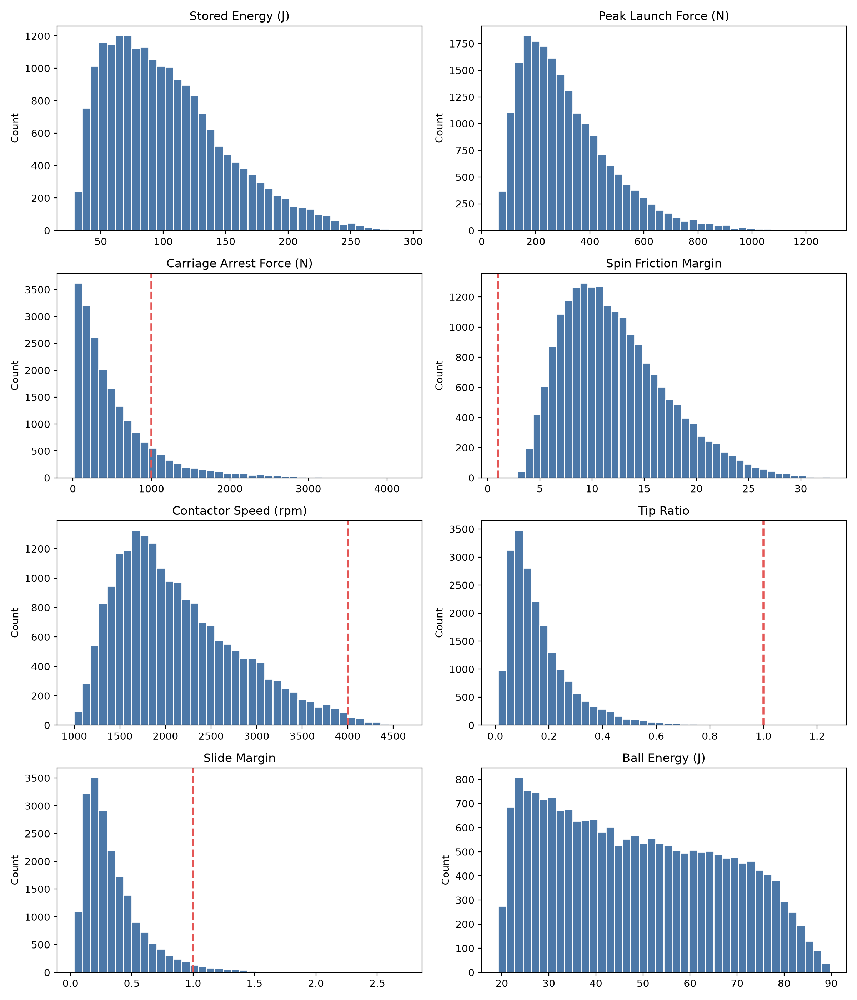
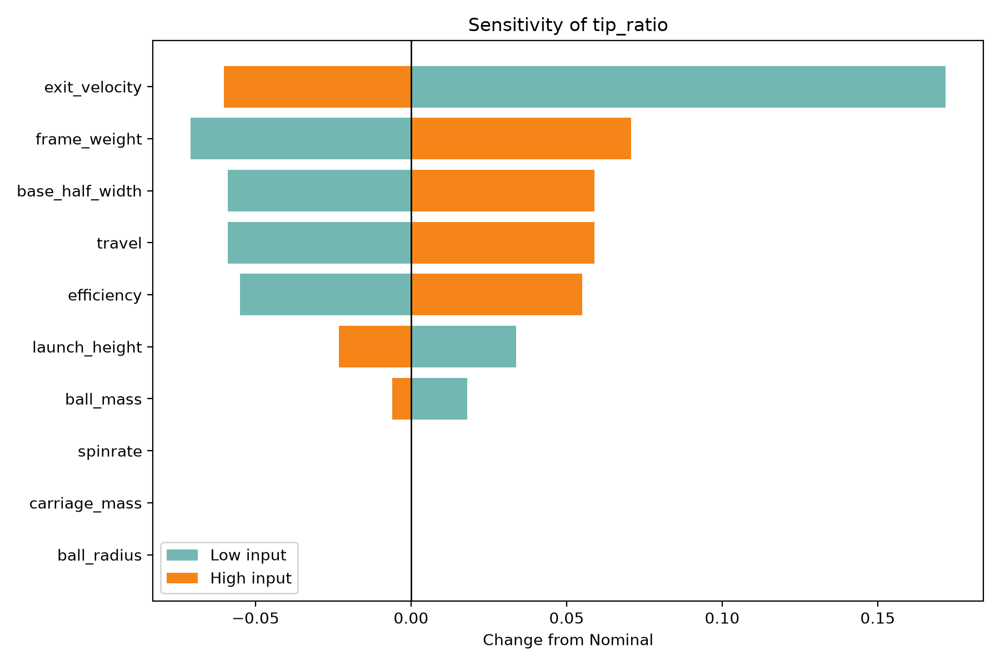
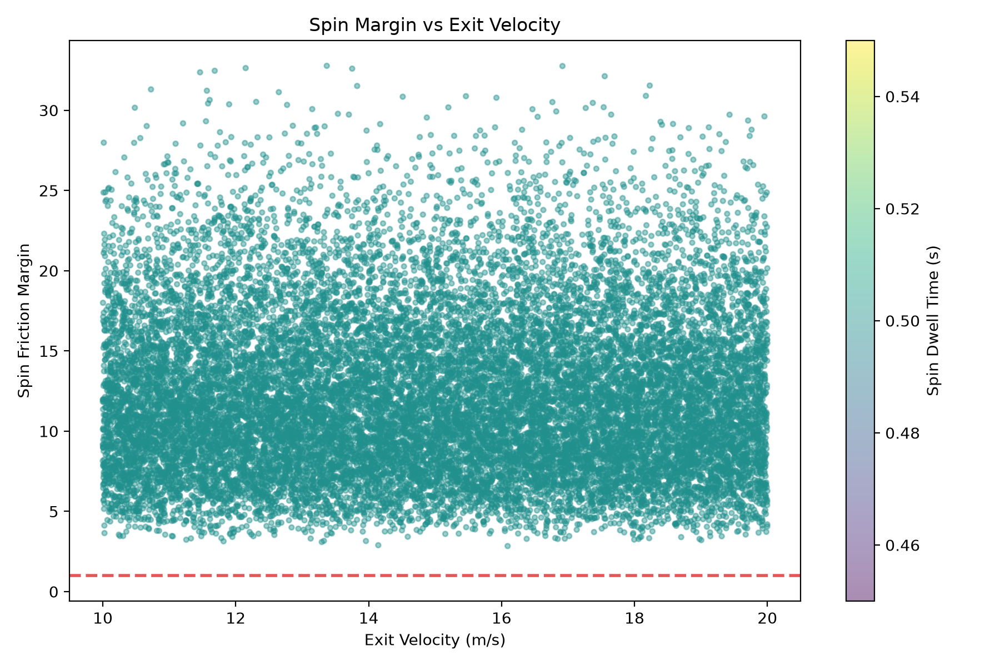

# Football Launcher Design Portfolio

Active portfolio project for a compact, single-operator American-football launcher, developed through systems engineering and first-order feasibility analysis before CAD and prototyping.

## Current Status

- Concept and systems-engineering package complete.
- 25-requirement product design specification and RFLP-style architecture complete.
- 20,000-run Python Monte Carlo feasibility model complete.
- Main engineering insight: frame tip-over and sliding are the governing constraints, so the base/leg stability subassembly is now driving CAD direction.
- CAD, engineering drawings, manufacturing notes and prototype evidence are in progress and will be added as they land.

This is an active project repository, not a claim of finished hardware. The current analysis is a first-order screening study used to identify design risks and priorities before committing to CAD and manufacture.

## Repository Map

- `Analysis/` - Python feasibility scripts for the Phase 6 Monte Carlo and sensitivity study.
- `Results/` - Monte Carlo distributions, tornado sensitivity plots, spin-margin scatter plot and `phase6_results.xlsx`.
- `Documentation/` - systems-engineering documents, V-model/RFLP/CONOPS material and the mini-portfolio PDF.
- `CAD/` - in progress; CAD files will be added when the stability-driven frame/base design is ready.
- `Drawings/` - in progress; fully-defined engineering drawings will be added after CAD matures.
- `Images/` - in progress; product renders/build images will be added as visual evidence becomes available.
- `Manufacturing/` - in progress; design-for-manufacture notes and prototype records will be added during the build phase.

## Key Outputs So Far

- A compact launcher concept for solo player training, intended to decouple ball speed from spin.
- A systems-engineering baseline linking stakeholders, CONOPS, requirements, architecture and verification planning.
- A first-order Python feasibility model sampling 18 uncertain parameters across 20,000 runs.
- Stability sensitivity results showing exit velocity, frame weight, base width, launch height, travel and ground friction as key drivers.
- A design response: foldable-but-rigid deployed legs and a verified stability footprint are now treated as core requirements.
- Carriage-arrest force: re-run with a 200 mm arrest stroke passes 100% of sampled configurations (mitigated).

## Selected Results

## Portfolio PDF

The application-stage mini-portfolio is available at:

[Documentation/Christian_Ihejirika_Mini_Portfolio.pdf](Documentation/Christian_Ihejirika_Mini_Portfolio.pdf)
